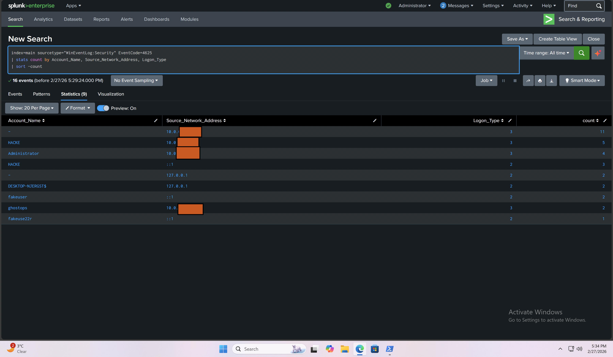
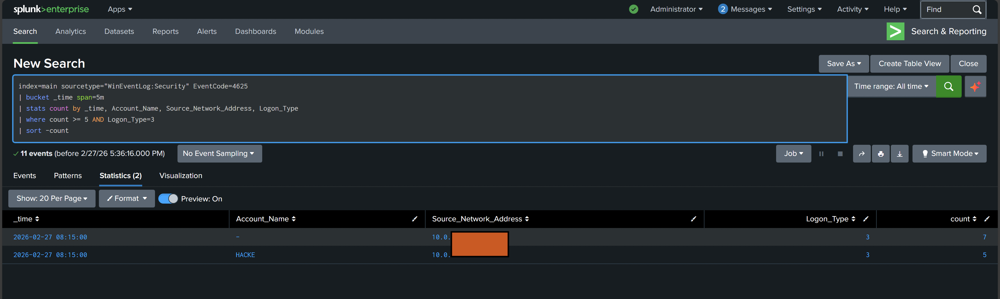

# Enterprise-Authentication-SOC-Lab
End-to-end enterprise authentication monitoring lab using Windows Event Logs, Sysmon, and Splunk Enterprise to detect brute-force attempts, successful logins, PowerShell execution, network activity, and simulated lateral movement mapped to MITRE ATT&CK.

---

## Objective

This project demonstrates a real-world SOC detection workflow:

Validate log ingestion pipeline  
Detect brute-force authentication attempts (Event ID 4625)  
Detect successful authentication events (Event ID 4624)  
Filter service-account noise  
Parse Sysmon XML telemetry  
Detect PowerShell execution (Sysmon Event ID 1)  
Detect network connections (Sysmon Event ID 3)  
Simulate lateral movement  
Build threshold-based alert logic  
Map detections to MITRE ATT&CK  

---

## Simulated Multi-Site SOC Architecture

This lab simulates an enterprise multi-site environment separating endpoint telemetry from SIEM infrastructure.

```
Site B (Endpoint – VirtualBox)
--------------------------------
Windows 10
+ Sysmon
+ Windows Security Logs
+ Splunk Universal Forwarder
        │
        │  (TCP 9997 – Forwarding Port)
        ▼
Site A (SIEM – VMware)
--------------------------------
Windows 11
+ Splunk Enterprise (Indexer + Search Head)
+ Detection Engineering
+ Alerting & Investigation
```

---

## Data Flow Explanation

Windows 10 (Site B) generates:

Security Event Logs  
Sysmon telemetry  

Splunk Universal Forwarder sends logs over TCP 9997  

Splunk Enterprise (Site A) receives, indexes, and analyzes logs  

SOC detections are built using SPL queries  

---

## Detection Walkthrough

### 1️⃣ Failed Logon Detection (Brute Force)

Query: [`spl/failed_logon_4625.spl`](spl/failed_logon_4625.spl)

Detects repeated failed login attempts.  

MITRE: T1110 – Brute Force  

---

### 2️⃣ Successful Login Detection

Query: [`spl/successful_logon_4624.spl`](spl/successful_logon_4624.spl)

Validates successful authentication events.  

MITRE: T1078 – Valid Accounts  

---

### 3️⃣ Authentication Timeline Reconstruction

Query: [`spl/authentication_timeline.spl`](spl/authentication_timeline.spl)

Reconstructs authentication event sequence to identify attack progression.

---

### 4️⃣ Sysmon Telemetry Validation

Query: [`spl/sysmon_eventid_breakdown.spl`](spl/sysmon_eventid_breakdown.spl)

Validates enriched endpoint telemetry including:

Process creation  
Network connections  
File creation  
Registry modifications  

---

### 5️⃣ PowerShell Execution Detection

Query: [`spl/powershell_execution_detection.spl`](spl/powershell_execution_detection.spl)

Detects PowerShell process execution activity.  

MITRE: T1059.001 – PowerShell  

---

### 6️⃣ Network Connection Detection

Query: [`spl/network_connection_detection.spl`](spl/network_connection_detection.spl)

Detects outbound network activity from the endpoint.  

MITRE: T1049 – System Network Connections Discovery  

---

### 7️⃣ Lateral Movement Detection

Query: [`spl/lateral_movement_detection.spl`](spl/lateral_movement_detection.spl)

Detects remote logon activity (Logon Type 3 and 10).  

MITRE: T1021 – Remote Services  

---

### 8️⃣ Brute Force Alert Logic

Query: [`spl/brute_force_alert_threshold.spl`](spl/brute_force_alert_threshold.spl)

Triggers alert if failed login attempts exceed defined threshold within 5 minutes.

---

## MITRE ATT&CK Mapping

| Behavior             | Technique |
| -------------------- | --------- |
| Brute Force          | T1110     |
| Valid Account Abuse  | T1078     |
| PowerShell Execution | T1059.001 |
| Network Discovery    | T1049     |
| Remote Services      | T1021     |

---

## SMB Brute Force Detection (Credential Access – T1110)

### Attack Simulation (Kali Linux)

The attack was simulated from Kali Linux (ATTACKER_IP) targeting Windows 10 (TARGET_IP) over SMB (TCP 445).

Command Used (Successful)

```bash
for i in {1..5}; do smbclient -L //TARGET_IP -U HACKE%WrongPass1!; done
```

This generated multiple failed SMB authentication attempts.

Confirmed:

Target reachable  
SMB port open  
Authentication failures logged  

---

## Detection Query – Failed Logons

File: [`09_spl/failed_logon_4625.spl`](09_spl/failed_logon_4625.spl)

```spl
index=main sourcetype="WinEventLog:Security" EventCode=4625
| stats count by Account_Name, Source_Network_Address, Logon_Type
| sort -count
```

What It Shows:

Failed authentication attempts  
Attacker IP address  
Logon type  
Targeted account  

📸 Screenshot #1  


---

## Threshold-Based Brute Force Alert

File: [`spl/brute_force_alert_threshold.spl`](spl/brute_force_alert_threshold.spl)

```spl
index=main sourcetype="WinEventLog:Security" EventCode=4625
| bucket _time span=5m
| stats count by _time, Account_Name, Source_Network_Address, Logon_Type
| where count >= 5 AND Logon_Type=3
| sort -count
```

Detection Logic:

EventCode 4625 → Failed login  
Logon_Type 3 → Network logon (SMB)  
Grouped in 5-minute window  
Alert when ≥5 failures occur  

📸 Screenshot #2  


---

## Skills Demonstrated

Splunk SPL development  
Windows authentication analysis  
Sysmon XML parsing using spath  
Detection engineering  
Multi-site log forwarding configuration  
Threshold-based alert creation  
MITRE ATT&CK mapping  
SOC investigative workflow  

---

## Tools Used

Splunk Enterprise (Windows 11 – VMware)  
Splunk Universal Forwarder (Windows 10 – VirtualBox)  
Sysmon  
Windows Event Logging  
MITRE ATT&CK Framework  

---

## Project Outcome

This lab demonstrates the ability to:

Build and configure a multi-site SOC architecture  
Ingest and parse endpoint telemetry  
Detect authentication-based attack techniques  
Engineer MITRE-aligned detections  
Structure detection logic professionally  
